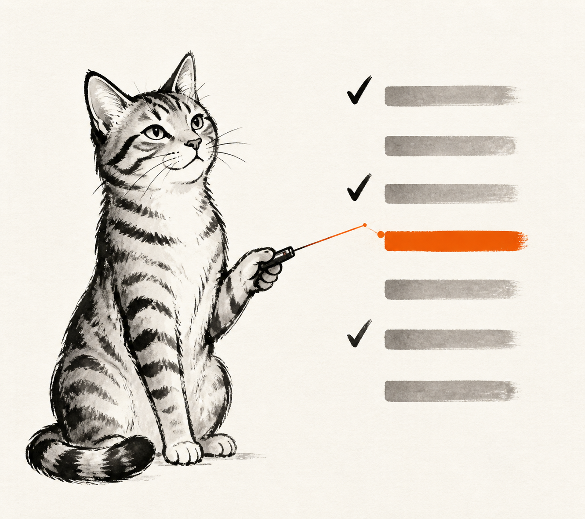
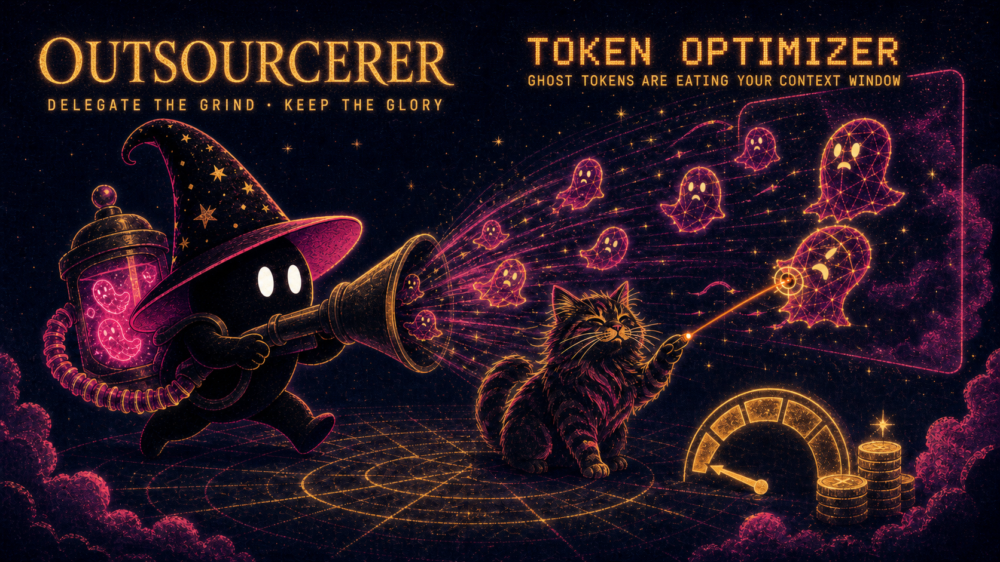

<p align="center">
  
</p>

<p align="center">
  <a href="https://github.com/alexgreensh/attention-span/releases"></a>
  
  
  <a href="LICENSE"></a>
  
  <a href="https://github.com/alexgreensh/attention-span/stargazers"></a>
</p>

<p align="center"></p>

<p align="center"><a href="README.md">English</a> · <b>Español</b> · <a href="README.zh-CN.md">中文</a></p>

Una pequeña colección de [estilos de salida](https://code.claude.com/docs/en/output-styles) para Claude Code que cambian *cómo te habla*, no cómo codifica. Primero la respuesta, lenguaje claro, fácil de escanear. Cada uno es un único archivo markdown que añades y activas.

Las reglas de concisión por defecto cuidan tu atención primero. Reducir la salida de Claude es un efecto secundario bienvenido, no el objetivo.

Tres hasta ahora: **Attention-kind** (el principal), **Spartan** (conciso, cero calidez) y **Rundown** (informes breves). Cada uno tiene su propia sección a continuación.

## Attention-kind

Un estilo apto para TDAH. Claude responde primero, se mantiene breve, elimina la jerga técnica y solo amplía lo que realmente merece tu atención. Cada punto está espaciado y marcado con un `→`, y las palabras importantes están en **negrita**, para que puedas escanear solo lo en negrita y obtener la respuesta completa.

La misma capacidad de ingeniería por debajo. Solo cambia la forma de entrega.

**Para quién es:** para cualquiera cuya atención sea un recurso limitado. TDAH, cansado, en pleno estado de flujo o simplemente harto de muros de texto.

### Antes / después

La pregunta: **"¿Qué base de datos debería usar para una nueva aplicación social, PostgreSQL o MongoDB?"** La misma respuesta, antes y después del estilo.

<table>
<tr>
<th align="left" width="50%">Predeterminado &nbsp;·&nbsp; 430 palabras</th>
<th align="left" width="50%">Attention-kind &nbsp;·&nbsp; 94 palabras</th>
</tr>
<tr valign="top">
<td>

Para una nueva aplicación social, comienza con PostgreSQL, y el umbral para elegir MongoDB en su lugar es alto. Las apps sociales son intensas en relaciones por naturaleza: los usuarios siguen a otros usuarios, las publicaciones pertenecen a usuarios, los comentarios pertenecen a publicaciones, los likes conectan usuarios con publicaciones. Es una red de conexiones, exactamente para lo que se construyó una base de datos relacional. En MongoDB, o metes los datos relacionados en un solo registro y luchas con los límites de tamaño, o los separas y terminas uniéndolos de nuevo en el código de tu app de todos modos. El problema del feed empeora esto: las cronologías, "publicaciones de personas que sigues" y búsquedas de amigos mutuos dependen del tipo de cruzamiento de referencias que Postgres hace en una sola consulta. También obtienes consistencia gratis, ya que los conteos de seguidores y las verificaciones de "¿ya me gustó esto?" requieren transacciones reales… *[y continúa así]*

</td>
<td>

**→ Usa PostgreSQL.** Una app social son todas relaciones (amigos, seguidores, likes), y Postgres las maneja de forma nativa. Apta para ~90% de las nuevas apps sociales.

**→ Mantienes flexibilidad.** Su columna JSONB almacena datos sin esquema dentro de la misma base de datos, así que obtienes la flexibilidad de MongoDB sin salir de Postgres.

**→ Elige MongoDB solo si** tus datos son documentos autónomos sin enlaces, y necesitas un volumen masivo de escritura desde el día uno.

**→ La trampa temprana con MongoDB:** a los seis meses, cinco formas diferentes de "usuario" y sin solución limpia. Postgres impone la estructura.

**→ Siguiente:** comienza con Postgres gestionado (Supabase, Neon, RDS).

</td>
</tr>
</table>

La misma información. Una de ellas puedes leerla de un vistazo.

### ¿Realmente ayuda? (medido y reproducible)

El benchmark mide el trabajo y la salida por separado, y las cifras principales no usan **ningún juez LLM**. Cada número es reproducible desde este repositorio. [Explicación completa y harness ejecutable.](benchmarks/results/2026-08-11-benchmark.md)

- **El trabajo queda intacto.** 12 tareas de código con suites de tests ocultos, con estilo y sin estilo: las tasas de acierto son iguales (**ambas 97%**, dentro del ruido). Sin juez, solo tests que pasan.
- **~43% menos de salida** de media (mediana 41%), y **50-71% en respuestas extensas** donde importa; las respuestas ya cortas apenas cambian.
- **Llegas al punto en ~6 palabras en lugar de ~40.** La respuesta está en la primera línea el **75%** de las veces frente al **3%**. (Los índices de legibilidad no aplican, solo miden la longitud de las palabras y no ven un muro de texto.)
- **Los entregables salen limpios el 88% de las veces** frente al 12% sin estilo: pides un mensaje o un commit y obtienes justo eso, sin envoltorio.

Es más corto, más claro y fácil de captar de un vistazo, con el trabajo intacto. No afirmamos que produzca mejores respuestas, no es para eso.

### ¿Qué cambia?

- **Respuesta primero.** Conclusión en la primera línea. Sin preámbulo.
- **Breve por defecto.** Dice lo mínimo necesario para responder completamente, y se detiene.
- **Amplía solo lo vital**, para que la longitud en sí misma señale importancia.
- **Lenguaje claro.** Los términos técnicos raros obtienen una definición de cinco palabras, una sola vez.
- **Diseñado para escanear.** Marcadores `→`, negritas pesadas, espaciado real entre puntos.
- **Sin repeticiones.** Cada punto hace un argumento distinto, nunca se reitera ni se reargumenta.
- **Re-anclaje en tareas largas** y hace una pregunta a la vez, para que nunca pierdas el hilo.
- **También los comentarios.** Los comentarios de código heredan la regla de lenguaje claro de "explicar el porqué", pero nunca el formato de chat.

## Spartan

<p align="center"></p>

Modo conciso con la calidez eliminada. Mismas flechas y negritas que Attention-kind, pero directo e imperativo, sin suavizantes, sin transiciones, máxima compresión. Para trabajo enfocado cuando quieres señal, no conversación.

La pregunta: **"Tres prioridades esta semana, espacio para dos, ¿cómo decido qué cortar?"** Ambos son salidas reales de evaluación de Opus 5.

<table>
<tr>
<th align="left" width="50%">Predeterminado &nbsp;·&nbsp; 310 palabras</th>
<th align="left" width="50%">Spartan &nbsp;·&nbsp; 168 palabras</th>
</tr>
<tr valign="top">
<td>

Corta la que falle la prueba más barata: si se retrasa una semana, quién realmente lo siente y cuánto. Pasa las tres por cuatro filtros rápidos y el perdedor suele caerse por su cuenta. Consecuencia del retraso: dos de tus tres probablemente tienen fechas límite blandas que inventaste y una tiene una real, una persona esperando, una dependencia aguas abajo, una ventana que se cierra. Corta de la pila autoimpuesta, nunca de la pila donde alguien está bloqueado por ti. Reversibilidad: algunas cosas se vuelven más difíciles cuanto más esperan, otras son exactamente igual de fáciles la semana que viene, así que corta la cuya curva de costo es plana. Quién la posee además de tú: si una prioridad puede delegarse o hacerse al 80% por otro, es un mejor corte que una que solo tú puedes hacer… *[y continúa así]*

</td>
<td>

**→ Ordena por el costo de NO hacerlo, no por esfuerzo o interés.** Pregunta a cada una: qué se rompe si esto se retrasa una semana. La que tenga la consecuencia más blanda se corta.

**→ Elimina la reversible.** Si una tarea puede esperar, delegarse o reiniciarse después sin penalización, córtala. Protege lo que tenga una **fecha límite dura** o una **dependencia** donde otros estén bloqueados por ti.

**→ Haz la prueba del arrepentimiento.** Viernes por la noche, ¿qué tarea sin hacer duele más? Quédate con esa. La que haría que fruncieras el ceño es tu corte.

**→ Separa lo ruidoso de lo importante.** La prioridad que te grita a menudo es solo la más **ansiosa**, no la más valiosa. Corta por impacto, no por volumen.

**→ No hagas las tres a medias.** Dos terminadas superan a tres al 66%. El trabajo parcial en la tercera es la trampa, se siente productivo y no entrega nada.

**→ Córtalo en voz alta.** Dile a quien esté afectado ahora, no el viernes. Un corte que se marca es una decisión, un corte que se esconde es un **fracaso con retraso**.

</td>
</tr>
</table>

La misma garantía de solo-estilo que Attention-kind: más corto, más escaneable, con el trabajo intacto. Ver el [benchmark](benchmarks/results/2026-08-11-benchmark.md).

## Rundown

<p align="center"></p>

Estilo de informe breve. Se abre con un **TL;DR**, muestra el estado como una lista de verificación ✅ / 🟡 / ⬜, etiqueta las siguientes opciones con emojis. Diseñado para actualizaciones de estado y reuniones diarias. **Optimiza la legibilidad y el escaneo, no la brevedad**, así que úsalo cuando la claridad sea más importante que la longitud. Incluye un mecanismo para evitar inventar estados que no se le dieron.

La pregunta: **"Resume en qué va la contratación: 20 candidatos, 5 filtrados, 2 entrevistas, sin oferta, un candidato fuerte que se escapa."** Ambos son salidas reales de evaluación de Opus 5.

<table>
<tr>
<th align="left" width="50%">Predeterminado &nbsp;·&nbsp; un párrafo que lees</th>
<th align="left" width="50%">Rundown &nbsp;·&nbsp; un tablero que escaneas</th>
</tr>
<tr valign="top">
<td>

La contratación está en la parte superior del embudo y delgada en la inferior. Veinte solicitudes dentro, cinco filtradas, dos entrevistas reservadas. Aún no se ha enviado ninguna oferta, y esa brecha es el problema: uno de los candidatos más fuertes se está enfriando mientras el proceso se queda inactivo. Los números: solicitudes 20, filtradas 5, entrevistas reservadas 2, ofertas enviadas 0, en riesgo 1 candidato fuerte que se escapa. La lectura: esto es un problema de velocidad, no de suministro. El embudo es saludable arriba, pero nada se ha convertido en una oferta, y la mejor prospectiva se está desvaneciendo. El movimiento de mayor valor es acelerar al candidato que se escapa antes de que el retraso decida por nosotros. Cuello de botella: la etapa de oferta… *[y continúa así]*

</td>
<td>

TL;DR: El embudo es saludable arriba pero la meta final se está estancando, y tu mejor candidato está a punto de marcharse.

**Embudo de contratación**
- ☑️ **Solicitudes recibidas:** 20 fuente
- ☑️ **Filtrados:** 5 de 20 hechos
- 🟡 **Entrevistas:** 2 reservadas, aún no realizadas
- ⬜ **Oferta:** no redactada, no enviada

🔴 **Bloqueo:** Un candidato fuerte se está escapando. Sin movimiento de oferta significa que los pierdes por defecto.

**Tu jugada:**
- 🚀 Acelera al candidato fuerte, salta directamente a hablar de oferta hoy
- 📞 Realiza las 2 entrevistas reservadas antes de decidir
- 📋 Filtra más de las 15 solicitudes sin tocar para tener respaldos
- ✍️ Redacta la oferta ahora para que esté lista para enviar

Elige uno: salva al candidato ahora, o ejecuta el proceso completo y arriesga perderlos?

</td>
</tr>
</table>

## ¿De verdad quieres reducir tu factura de tokens?

Attention Span existe para que las respuestas de tus agentes sean legibles y fáciles de captar de un vistazo. La factura de tokens más ligera en esas respuestas es un efecto secundario bienvenido. Si reducir el gasto de tokens es tu verdadero objetivo, el costo mayor es el *trabajo* que hace tu agente, no cómo habla, y dos herramientas hermanas van directas a ello, combinando de forma natural con estos estilos:

<p align="center"></p>

**[Token Optimizer](https://github.com/alexgreensh/token-optimizer)** ataca las tres capas de desperdicio de tokens que la mayoría de las herramientas nunca tocan:

- **Estructural**, p. ej. configuraciones infladas, skills sin usar, memoria obsoleta
- **En ejecución**, p. ej. salida verbosa, relecturas
- **De comportamiento**, p. ej. mal enrutamiento de modelos, expiración de caché, bucles de reintentos

...y más en cada una. Además, comprime tu stack de salida, hace checkpoints y restaura tu trabajo para que tus sesiones sigan continuas a través de la compactación, y pone cada token y dólar ahorrado en un panel en vivo. También es la única herramienta que mide la calidad de tu contexto y se ajusta a ella, porque una sesión más barata que hace peor trabajo no es ningún ahorro.

*Funciona en Claude Code, Codex, OpenCode, OpenClaw, Hermes y Copilot.*

**[Outsourcerer](https://github.com/alexgreensh/outsourcerer)** — quédate en una sola sesión del agente que más te guste. En segundo plano:

- ejecuta un escuadrón entre los modelos y harnesses que ya pagas
- elige el mejor para cada tarea **por benchmark, no solo por precio**
- revisa su trabajo y vigila tus límites en cada motor

Tú mantienes la cabina; el trabajo pesado ocurre en otra parte.

*Funciona en Claude Code, Codex, Antigravity, Devin, Droid, Cursor, Warp y Hermes.*

Attention Span reduce cuánto dice Claude. Estas dos gobiernan lo que gasta todo tu stack.

## Instalación

**1.** Coloca el estilo en tu carpeta de output-styles. Global (para todos los proyectos):

```bash
mkdir -p ~/.claude/output-styles
curl -o ~/.claude/output-styles/attention-kind.md \
  https://raw.githubusercontent.com/alexgreensh/attention-span/main/output-styles/attention-kind.md
```

O colócalo en `.claude/output-styles/` dentro de un solo proyecto.

**2.** Establécelo como predeterminado en `~/.claude/settings.json`. Haz esto una vez y estará activado en cada sesión, para siempre:

```json
{ "outputStyle": "Attention-kind" }
```

**3.** Reinicia o escribe `/clear`. Eso es todo.

¿Quieres probarlo en una sesión primero? Ejecuta `/config` y selecciónalo bajo *Estilo de salida*, luego establece el predeterminado anterior una vez que estés convencido.

**Costo:** ~650 tokens, añadidos una vez por sesión y almacenados en caché después de la primera solicitud. El benchmark midió ~43% menos de salida, así que el costo de entrada es insignificante tras la primera respuesta.

## Los estilos

| Estilo | Archivo | Mejor para |
|---|---|---|
| Attention-kind | [`output-styles/attention-kind.md`](output-styles/attention-kind.md) | TDAH, fatiga de atención, cualquiera cansado de muros de texto |
| Spartan | [`output-styles/spartan.md`](output-styles/spartan.md) | Modo Spartan: máxima señal, cero calidez, trabajo enfocado |
| Rundown | [`output-styles/rundown.md`](output-styles/rundown.md) | Informes breves, reuniones diarias, actualizaciones de progreso (TL;DR + casillas) |

Cada uno es un archivo markdown legible, fácil de adaptar.

## Notas

- Los estilos se aplican **solo a la conversación principal**. Los subagentes ejecutan su propio prompt.
- Estos mantienen intacto el comportamiento de codificación de Claude (`keep-coding-instructions: true`).

## Licencia

AGPL-3.0. Ver [LICENSE](LICENSE).
