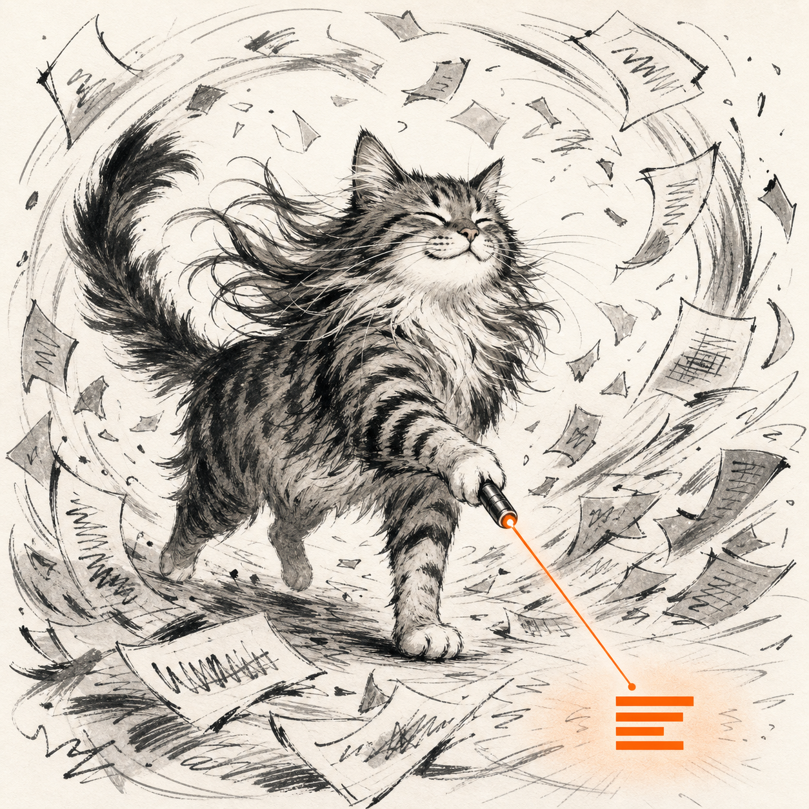

# Attention Span

**Pay attention, not tokens.**



A small collection of [output styles](https://code.claude.com/docs/en/output-styles) for Claude Code that change how it *talks to you*, not how it codes. Answer-first, plain English, easy to skim. Each one is a single markdown file you drop in and switch on.

The concise-by-default rules aren't just kind to your attention, they trim Claude's output, so you literally spend fewer tokens. The pun pays for itself.

First in the set: **Attention-kind**.

## Attention-kind

An ADHD-friendly style. Claude answers first, keeps it short, drops the jargon, and expands only on what's actually worth your attention. Every point is spaced out and marked with a `→`, and the important words are **bold**, so you can skim just the bold and still get the whole answer.

Same engineering ability underneath. Only the delivery changes.

**Who it's for:** anyone whose attention is a limited resource. ADHD, tired, deep in flow, or just done with walls of text.

### Before / after

Same question, same model, same correct answer. *"I have three priorities this week and can only finish two. How do I decide what to cut?"* Both are **real eval outputs**. One is a wall you have to read. The other you can skim in five seconds.

<table>
<tr>
<th align="left" width="50%">Default &nbsp;·&nbsp; 385 words</th>
<th align="left" width="50%">Attention-kind &nbsp;·&nbsp; 196 words</th>
</tr>
<tr valign="top">
<td>

You've got three priorities and room for two, so the real question isn't "which is best?" but "which one survives being cut?" Run each through four filters, in order. First, consequence of delay: if this slips a week, what actually happens, something breaks or someone's mildly annoyed? Second, who's downstream, a task that unblocks other people is worth more than one that only touches you. Third, cost of the switch, some things get cheaper if you wait and some get more expensive, so cut the one that ages best. Fourth, the regret test: fast-forward to Friday, which un-done item makes you wince hardest? Where this usually lands: keep the hard-deadline one and the one that unblocks others, and cut the self-imposed, reversible one even if it's the one you most want to do…

</td>
<td>

**→ Score each on impact times regret, cut the lowest.** If it slips a week, what breaks and who's waiting? "Nothing and nobody" is your cut.

**→ Separate loud from important.** The priority screaming at you is usually the nearest deadline, not the biggest stakes.

**→ Check for a hidden dependency.** If finishing one unblocks others, its real value is higher than it looks alone.

**→ Cut, don't shrink all three.** Two done beats three at 70%, because 70% usually can't ship.

**→ Tell whoever owns the cut one, today.** A silent slip becomes a broken promise.

</td>
</tr>
</table>

Same information. One of them you can read at a glance.

### Does it actually help? (measured)

12 questions across 8 categories (dev, research, analysis, explaining, writing, quick lookups), each answered 4 times, two runs averaged, scored by a separate judge. [Full results.](benchmarks/results/2026-08-05-diverse-variance.md)

- **48% fewer output tokens.**
- **Answer-first: 50% → 100%.** The default buried the answer under preamble half the time.
- **Skimmability: 3.3 → 4.9** on a 1-5 scale.
- **Unexplained jargon: 2.8 → 1.0 terms per answer.**
- **Correctness held at 100%** across all 48 answers. Shorter cost nothing.

It holds beyond code: research (-53%), analysis (-55%), and explaining (-50%) cut as hard as debugging. The one place it barely moves is already-short output, a two-line email only shrank 4%, because the style trims rambling and leaves tight answers alone. The gains scale with how much Claude would have over-explained. [Earlier dev-only run, Opus 4.8 vs 5.](benchmarks/results/2026-08-04-attention-kind-vs-default.md)

### What changes

- **Answer first.** Conclusion in line one. No wind-up.
- **Short by default.** Says the least that fully answers, then stops.
- **Expands only on what's vital**, so length itself signals importance.
- **Plain English.** Rare technical terms get a five-word definition, once.
- **Built to scan.** `→` markers, heavy bold, real spacing between points.
- **Comments too.** Code comments inherit the plain-English "explain the why" rule, but never the chat formatting.

## Install

**1.** Copy the style you want into your output-styles folder.

Global (every project):

```bash
mkdir -p ~/.claude/output-styles
curl -o ~/.claude/output-styles/attention-kind.md \
  https://raw.githubusercontent.com/USER/attention-span/main/output-styles/attention-kind.md
```

Or drop the file into `.claude/output-styles/` inside a single project.

**2.** Run `/config`, pick the style under *Output style*.

**3.** Optional, make it the permanent default in `~/.claude/settings.json`:

```json
{ "outputStyle": "Attention-kind" }
```

**4.** Restart or `/clear`. Styles load once at session start.

**Cost:** ~470 tokens, added once per session, cached after the first request. The "short by default" rule tends to save more output tokens than that over a conversation.

## The styles

| Style | File | Best for |
|---|---|---|
| Attention-kind | [`output-styles/attention-kind.md`](output-styles/attention-kind.md) | ADHD, attention fatigue, anyone tired of walls of text |

More coming. Each is one readable markdown file, easy to fork and tune.

## Notes

- Styles apply to the **main conversation only**. Subagents run their own prompt.
- These keep Claude's coding behavior intact (`keep-coding-instructions: true`).

## License

MIT. Use it, fork it, make it kinder.
